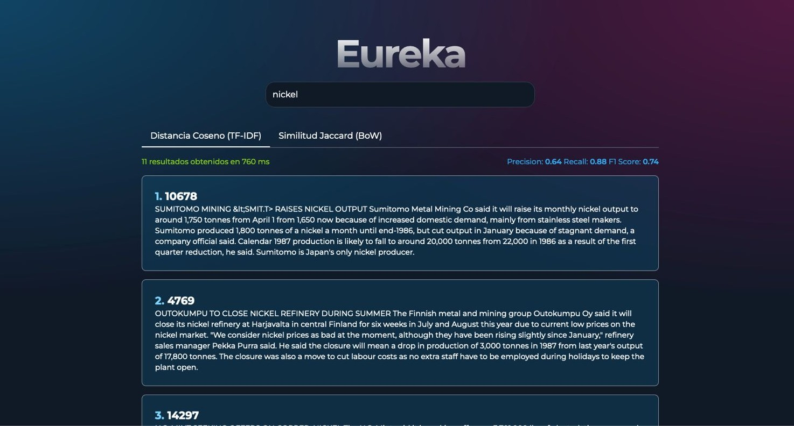

# Eureka
Eureka Information Retrieval Search
---

## Why is our search engine called eureka?

Heuristics (from the Greek εὑρίσκειν),1​ which means "to find, invent" (the past perfect of this verb is eureka),2​ appears in more than one grammatical category. When used as a noun, it refers to the discipline, art, or science of discovery.

These two uses are closely related, since heuristics usually propose strategies that guide discovery.

---

<a id="readme-top"></a>


<!-- PROJECT SHIELDS -->
<!--
*** I'm using markdown "reference style" links for readability.
*** Reference links are enclosed in brackets [ ] instead of parentheses ( ).
*** See the bottom of this document for the declaration of the reference variables
*** for contributors-url, forks-url, etc. This is an optional, concise syntax you may use.
*** https://www.markdownguide.org/basic-syntax/#reference-style-links
-->
[![Contributors][contributors-shield]][contributors-url]
[![Forks][forks-shield]][forks-url]
[![Stargazers][stars-shield]][stars-url]
[![Issues][issues-shield]][issues-url]
[![GPL-3.0 License][license-shield]][license-url]
[![LinkedIn][linkedin-shield]][linkedin-url]

<!-- PROJECT LOGO -->
<br />
<div align="center">
  <a href="https://github.com/eureka-project">
    
  </a>

  <h3 align="center">Eureka Information Retrieval Search</h3>

  <p align="center">
    An innovative search engine utilizing cosine distance (TF-IDF) and Jaccard similarity (BoW) with a user-friendly interface and automatic search.
    <br />
    <a href="https://github.com/orgs/DYNECRON/eureka"><strong>Explore the docs »</strong></a>
    <br />
    <br />
    <a href="https://github.com/DYNECRON/eureka">View Demo</a>
    ·
    <a href="https://github.com/DYNECRON/eureka/issues/new?labels=bug&template=bug-report---.md">Report Bug</a>
    ·
    <a href="https://github.com/DYNECRON/eureka/issues/new?labels=enhancement&template=feature-request---.md">Request Feature</a>

  </p>
</div>

<!-- TABLE OF CONTENTS -->
<details>
  <summary>Table of Contents</summary>
  <ol>
    <li>
      <a href="#about-the-project">About The Project</a>
      <ul>
        <li><a href="#built-with">Built With</a></li>
      </ul>
    </li>
    <li>
      <a href="#getting-started">Getting Started</a>
      <ul>
        <li><a href="#prerequisites">Prerequisites</a></li>
        <li><a href="#installation">Installation</a></li>
      </ul>
    </li>
    <li><a href="#usage">Usage</a></li>
    <li><a href="#roadmap">Roadmap</a></li>
    <li><a href="#contributing">Contributing</a></li>
    <li><a href="#license">License</a></li>
    <li><a href="#contact">Contact</a></li>
    <li><a href="#acknowledgments">Acknowledgments</a></li>
  </ol>
</details>

<!-- ABOUT THE PROJECT -->
## About The Project

[![Product Name Screen Shot][product-screenshot]](images/usage-eureka.jpeg)

Eureka is a search engine that utilizes cosine distance (TF-IDF) and Jaccard similarity (BoW) to provide accurate and relevant search results. With an innovative user interface and automatic search functionality, users can find what they're looking for without needing to press enter.

Here's why Eureka stands out:

* Innovative user interface that simplifies the search process.
* Automatic search functionality, removing the need to press enter.
* Utilizes advanced algorithms (cosine distance, TF-IDF, Jaccard similarity) for precise information retrieval.


Of course, no single solution will serve all projects since your needs may be different. You may suggest changes by forking this repository and creating a pull request or opening an issue. Thanks to all the people who have contributed to the development of Eureka!


<p align="right">(<a href="#readme-top">back to top</a>)</p>

### Built With

This project is built with the following technologies:
* [![SvelteKit][SvelteKit]][SvelteKit-url]
* [![Skeleton UI][Skeleton]][Skeleton-url]
* [![FastAPI][FastAPI]][FastAPI-url]

<p align="right">(<a href="#readme-top">back to top</a>)</p>

<!-- GETTING STARTED -->
## Getting Started

To get a local copy up and running, follow these simple steps.

### Prerequisites

You need to have Docker installed to deploy Eureka in production or dev.

### Installation

1. Clone the repo
   ```sh
   git clone https://github.com/DYNECRON/eureka.git
   ```
2. Build and start the containers
   ```sh
   docker-compose up -d --build
   ```

<p align="right">(<a href="#readme-top">back to top</a>)</p>

<!-- USAGE EXAMPLES -->
## Usage

The user simply enters a query and the information is retrieved. The interface is designed for ease of use and efficient searching.



_For more examples, please refer to the [Documentation](https://github.com/DYNECRON/eureka/wiki)_

<p align="right">(<a href="#readme-top">back to top</a>)</p>

<!-- ROADMAP -->
## Roadmap

- [x] Add TF-IDF
- [x] Add BoW
- [ ] Implement advanced information retrieval using transformers
- [ ] Enhance user interface with additional features and filters
- [ ] Develop comprehensive documentation for all system components
- [ ] Multi-language Support
    - [x] English
    - [ ] Spanish

See the [open issues](https://github.com/DYNECRON/eureka/issues) for a full list of proposed features (and known issues).


<p align="right">(<a href="#readme-top">back to top</a>)</p>

<!-- CONTRIBUTING -->
## Contributing

Contributions are what make the open-source community such an amazing place to learn, inspire, and create. Any contributions you make are **greatly appreciated**.

If you have a suggestion that would make this better, please fork the repo and create a pull request. You can also simply open an issue with the tag "enhancement". Don't forget to give the project a star! Thanks again!

1. Fork the Project
2. Create your Feature Branch (`git checkout -b feature/AmazingFeature`)
3. Commit your Changes (`git commit -m 'Add some AmazingFeature'`)
4. Push to the Branch (`git push origin feature/AmazingFeature`)
5. Open a Pull Request

<p align="right">(<a href="#readme-top">back to top</a>)</p>

<!-- LICENSE -->
## License

Distributed under the GPL-3.0 License. See [LICENSE](https://github.com/DYNECRON/eureka/blob/main/LICENSE) for more information.


<p align="right">(<a href="#readme-top">back to top</a>)</p>

<!-- CONTACT -->
## Contact

Eureka Development Team 

- [@Cheveniko](https://github.com/Cheveniko) - Nicolas Baquero
- [@Pinkylml](https://github.com/Pinkylml) - Jefferson Cando
- [@Afkerian](https://github.com/Afkerian) - Alejandro Moya

Project Link: [https://github.com/DYNECRON/eureka/](https://github.com/DYNECRON/eureka/)

<p align="right">(<a href="#readme-top">back to top</a>)</p>

<!-- ACKNOWLEDGMENTS -->
## Acknowledgments

I would like to thank the following resources and individuals who have contributed to the development and support of Eureka:

* Gerard Salton
* Christopher D. Manning
* Hinrich Schütze
* Stephen E. Robertson
* Karen Sparck Jones
* William B. Frakes
* Dynecron
* All the famous mathematicians, computer scientists, and others who have contributed to the development of these algorithms and methods

<p align="right">(<a href="#readme-top">back to top</a>)</p>

<!-- MARKDOWN LINKS & IMAGES -->
<!-- https://www.markdownguide.org/basic-syntax/#reference-style-links -->
[contributors-shield]: https://img.shields.io/github/contributors/DYNECRON/eureka.svg?style=for-the-badge
[contributors-url]: https://github.com/DYNECRON/eureka/graphs/contributors
[forks-shield]: https://img.shields.io/github/forks/DYNECRON/eureka.svg?style=for-the-badge
[forks-url]: https://github.com/DYNECRON/eureka/network/members
[stars-shield]: https://img.shields.io/github/stars/DYNECRON/eureka.svg?style=for-the-badge
[stars-url]: https://github.com/DYNECRON/eureka/stargazers
[issues-shield]: https://img.shields.io/github/issues/DYNECRON/eureka.svg?style=for-the-badge
[issues-url]: https://github.com/DYNECRON/eureka/issues
[license-shield]: https://img.shields.io/github/license/DYNECRON/eureka.svg?style=for-the-badge
[license-url]: https://github.com/DYNECRON/eureka/blob/master/LICENSE.txt
[linkedin-shield]: https://img.shields.io/badge/-LinkedIn-black.svg?style=for-the-badge&logo=linkedin&colorB=555
[linkedin-url]: https://www.linkedin.com/company/100076138/admin/dashboard/
[SvelteKit]: https://img.shields.io/badge/sveltekit-000000?style=for-the-badge&logo=svelte&logoColor=white
[SvelteKit-url]: https://kit.svelte.dev/
[Skeleton]: https://img.shields.io/badge/skeleton-35495E?style=for-the-badge&logo=skeleton&logoColor=white
[Skeleton-url]: https://www.skeleton.dev/
[FastAPI]: https://img.shields.io/badge/fastapi-009688?style=for-the-badge&logo=fastapi&logoColor=white
[FastAPI-url]: https://fastapi.tiangolo.com/
[product-screenshot]: images/usage-eureka.jpeg

